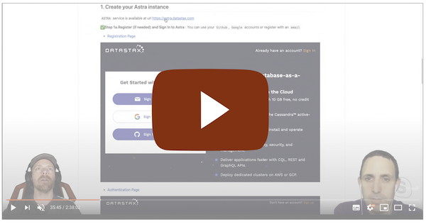
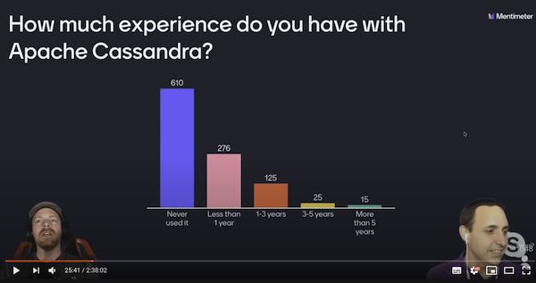
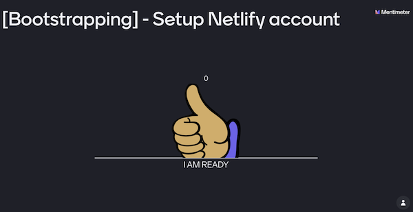
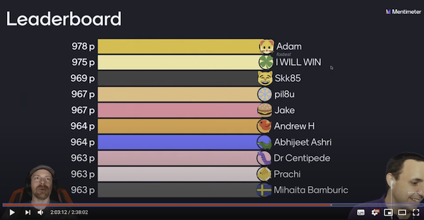
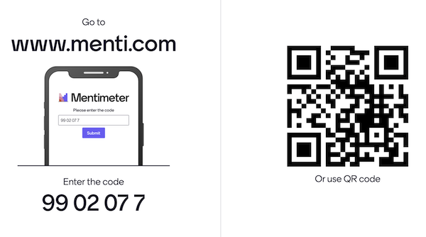
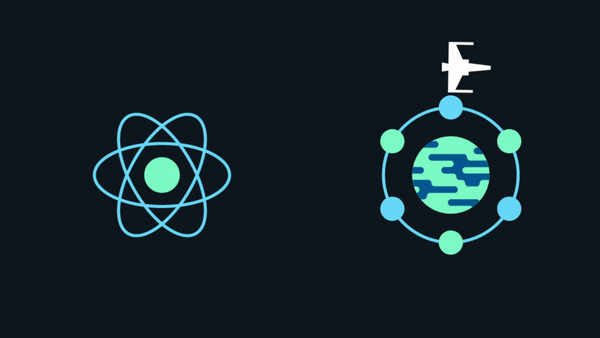

# 🚀 JamStack + 🧑‍🚀 React + 🧑‍💻 Workshop

 

Welcome to **BattleStax**, an online party game that you can enjoy with your friends. BattleStax is implemented as a [JAMStack](https://jamstack.org/) app that uses [Stargate](https://stargate.io), [Netlify](https://www.netlify.com/jamstack/), [Astra](https://dtsx.io/workshop), and [GitHub](https://github.com/) to demonstrate how to build and deploy an application using modern, scalable architectures. 

In this 3 hour workshop you will create your own **BattleStax** game using [React](https://reactjs.org/) and [Redux](https://redux.js.org/) implemented with a CI/CD pipeline, global CDN network, and [Apache Cassandra](https://cassandra.apache.org/) all using **FREE** tech.

## ℹ️ Housekeeping

Click to view the housekeeping items (<i><!--Youtube stream, -->Discord Chat,  Mentimeter quizz, the crew</i>)

It doesn't matter if you join our workshop live or you prefer to do at your own pace, we have you covered. In this repository, you'll find everything you need for this workshop.

<!-- 
### 🎥 Live and questions with Youtube**

The workshop is live Streamed on youtube, twitch and linkedin. After the session the recordings will be available on our [`DataStax Developers YouTube channel`](https://www.youtube.com/channel/UCAIQY251avaMv7bBv5PCo-A)

*Click The image to join the stream*

-->

### 💬 Chat with Discord*

Join our discord room [*The Fellowship of the Rings*](https://discord.com/widget?id=685554030159593522&theme=dark) to chat with the team and meet our 6k+ community there.

### ❓ Quizz with Mentimeter

This workshop is *INTERACTIVE*. Not only you interact with the speakers through questions but there is more:

- We want to ask you some questions

- We want you to mark when the exercise is complete 

- We want you win some SWAG with some competitions and live QUIZZES

To do so we are using [Mentimeter](https://www.mentimeter.com/). To play with us follow the instructions below. The code is **`99 02 07 7`**. You can also [open this link](https://www.menti.com/wzz24ja21f) in a new tab.

### 🧑🏻‍🤝‍🧑🏽 The Crew

The materials has been prepared with live with our great team

|  |  |  | |
|--- | --- | --- | --- |
| Chris Whilhite  [@kidrecursive](https://github.com/kidrecursive) | David Gilardi  [@SonicDMG](https://github.com/SonicDMG)| Rebecca Millis  [@beccam](https://github.com/beccam) | Cedrick Lunven [@clun](https://github.com/clun)|

<!--
## 🚀🚀 🚀  Let's Play the Game !

Brace yourselves, everybody goes to [https://battlestax-workshop.netlify.app/](https://battlestax-workshop.netlify.app/). 

-->

## 🗓️ Table of Contents

*All the tutorials and readme files are on the **master**. The **bootstraping** step is mandatory for you do the exercises. Then, checkout the branch you need to jump to any step. Get a look at all branches [here](https://github.com/DataStax-Academy/battlestax/branches)*

- **Bootstraping**
  - 📚 [What is the JAMStack](./README_JAM.md)
  - ⚒️ [Setup and deploy your first app](./README_step00.md) *(branch `master`)*
- **Step 1 - Serverless**
  - 📚 [What can Netlify do for you](./README_Netlify.md)
  - ⚒️ [Expose your "hello world" API](./README_step01.md) (*branch: `step-1`*)
- **Step 2 - Implement a Serverless Data API**
  - 📚 [What are DataStax Astra and Stargate](./README_Astra_Stargate.md)
  - ⚒️ [Implement a CRUD Api in Astra](./README_step02.md) (*branch: `step-2`*)
- **Step 3 - Client and State Management with Redux**
  - 📚 [What are Redux and React](./README_Redux_React.md)  
  - ⚒️ [Create client state with Redux](./README_step03.md) (*branch: `step-3`*)
- **Step 4 - React stuff** 
  - ⚒️ [Bind Redux to the User Interface](./README_step04.md) (*branch: `step-4`*)
- **What's NEXT ?** *(not the framework* 😈)
  - 📚 [Extra Resources and certifications](./README_Resources.md)   
  - 💚 [Share the love](https://github.com/DataStax-Academy/battlestax/blob/master/README_Resources.md#-share-the-love)

*click the image to start !*

**🏠 [Table of Contents](./README.md#%EF%B8%8F-table-of-contents)** | ***next=>** 📚 [What is the JAMStack](./README_JAM.md)*
