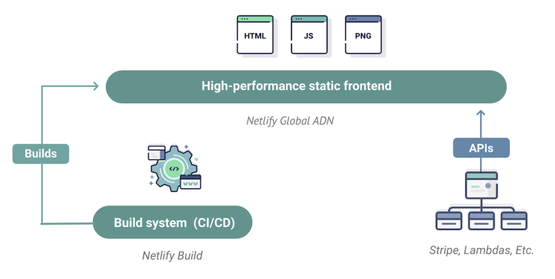

# 📚 What is the JAM Stack

🏠 [Table of Contents](./README.md#%EF%B8%8F-table-of-contents) > 📚 **[What is the JAMStack](#README_JAM.MD)** | ***next=>**  ⚒️ [Setup and deploy your first app](./README_step00.md)*

If you are already familiar with **JAMStack** and just want to move on to the first exercise go to the next section => *[Setup and deploy your first app](./README_step00.md)*. Otherwise, read on.

1. [Introduction to the JAMStack](#1-introduction-to-the-jamstack)
2. [Why this is cool ?](#2-why-this-is-cool-)
3. [Introduction to Netlify](#3-introduction-to-netlify)
4. [Want to learn more ?](#4-want-to-learn-more-)

## 1. Introduction to the JAMStack

> *Sources [JamStack.org](https://jamstack.org/) and [Netlify Documentation](https://www.netlify.com/jamstack/)*

Jamstack is the new standard architecture for the web. Using Git workflows and modern build tools, pre-rendered content is served to a CDN and made dynamic through APIs and serverless functions. Technologies in the stack include JavaScript frameworks, Static Site Generators, Headless CMSs, and CDNs.

**🔵 Javascript:** can represent any modern Javascript/Typescript framework like `React`, `Vue`, or `Angular` or even vanilla JS.
<table>
 <tr>
  <td></td>
  <td><a href="https://reactjs.org/">ReactJS (we will use it today)</a>: </td>
 </tr>
 <tr>
  <td></td>
  <td><a href="https://angularjs.org/">AngularJS</a></td>
 </tr>
<tr>
  <td></td>
 <td><a href="https://vuejs.org/">VueJS</a></td>
 </tr>
</table>

 

**🔵 API:** is a backend serving real time data through either REST or GraphQL, endpoints to interact with fetch, ajax,axios

<table>
  <tr>
  <td></td>
 <td><a href="https://vuejs.org/">REST (we will use it today)</a></td>
 </tr>
<tr>
  <td></td>
 <td><a href="https://graphql.org/learn/">GraphQL</a></td>
 </tr>
</table>

 

**🔵 Markup:** can be either plain old HTML or static content like markdown. This is the nature of markup that will determine the static page generator technology

<table>
 <tr>
  <td></td>
 <td><a href="https://developer.mozilla.org/en-US/docs/Web/Guide/HTML/HTML5/">Vanilla HTML (we will use this today)</a></td>
 </tr>
 <tr>
  <td></td>
 <td><a href="https://www.markdownguide.org/">Markdown</a></td>
 </tr>
</table>

 

**🔵 Static page generator:** You can find a pretty exhaustive list [here](https://jamstack.org/generators/). Most commonly used are Gatsby|Hugo|Jekyll for markdown files and [NextJS](https://nextjs.org/) for pure React.

<table>
 <tr>
   <td></td>
   <td><a href="https://www.gatsbyjs.com//"><b>Gatsby JS</b> </a> Build blazing-fast, modern apps and websites with React</td>
  </tr>
  <tr>
    <td></td>
    <td><a href="https://nextjs.org/"><b>Next.js</b></a> Next.js is a minimalistic framework for server-rendered React applications as well as statically exported React apps.</td>
  </tr>
  <tr>
    <td></td>
    <td><a href="https://www.markdownguide.org/"><b>Jekyll</b></a> Jekyll is a simple, blog-aware, static site generator perfect for personal, project, or organization sites. Think of it like a file-based CMS, without all the complexity. Jekyll takes your content, renders Markdown and Liquid templates, and spits out a complete, static website ready to be served by Apache, Nginx or another web server. Jekyll is the engine behind GitHub Pages, which you can use to host sites right from your GitHub repositories.</td>
  </tr>
  <tr>
    <td></td>
    <td><a href="https://www.markdownguide.org/"><b>Hugo</b></a> Hugo is a static site generator written in Go. It is optimized for speed, easy use and configurability. Hugo takes a directory with content and templates and renders them into a full html website. Hugo makes use of Markdown files with front matter for meta data.</td>
  </tr>
</table>

 

**🔵 Pre-rendering AND Decoupling:** The core principles of **pre-rendering**, and **decoupling**, enable sites and applications to be delivered with greater confidence and resilience than ever before.

**🔵 CDN:** : geographically distributed group of servers which work together to provide fast delivery of Internet content.

A CDN allows for the quick transfer of assets needed for loading Internet content including HTML pages, javascript files, stylesheets, images, and videos. The popularity of CDN services continues to grow, and today the majority of web traffic is served through CDNs, including traffic from major sites like Facebook, Netflix, and Amazon.

**🔵 Before vs after** 

**🔵 Pre-rendering:** 

**🔵 Decoupling:** 

**🔵 Move to CDN:** 

## 2. Why this is cool ?

### 🔐 2.1 - Security

> *Do you remember `/wp-admin.php` ? Me too.* The elder Cedrick

The Jamstack removes multiple moving parts and systems from the hosting infrastructure resulting in fewer servers and systems to harden against attack.

Serving pages and assets as pre-generated files allows **read-only hosting** reducing attack vectors even further. Meanwhile dynamic tools and services can be provided by vendors with teams dedicated to securing their specific systems and providing high levels of service.

### 🌐 2.2 - Scalalibility

> *Have you ever Ddos Amazon CloudFront ? Neither have I* the elder Cedrick.

When sites can be served entirely from a CDN there is no complex logic or workflow to determine what assets can be cached and when.

With Jamstack sites everything can be cached in a content delivery network. With simpler deployments, built-in redundancy and **incredible load capacity.**

### 🚀 2.3 - Performance

Page loading speeds have an impact on user experience and conversion. Jamstack sites remove the need to generate page views on a server at request time by instead generating pages ahead of time during a build.

With all the pages are already available on a CDN close to the user and ready to serve, very high performance is possible without introducing expensive or complex infrastructure.

### 🆘 2.4 - Maintainability

When hosting complexity is reduced, so are maintenance tasks. A pre-generated site, being served directly from a simple host or directly from a CDN does not need a team of experts to "keep the lights on".

The work was done during the build, so now the generated site is stable and can be hosted without servers which might require patching, updating and maintain.

### 📦 2.5 - Portability

Jamstack sites are pre-generated. That means that you can host them from a wide variety of hosting services and have greater ability to move them to your preferred host. Any simple static hosting solution should be able to serve a Jamstack site.

Bye-bye infrastructure lock-in.

### 💡 2.6 - Developer Experience

Let us show you this one today

## 3. Introduction to Netlify

> *Source [https://www.netlify.com](https://www.netlify.com/)*

### 3.1 Netlify in a nutshell

**Decoupling the frontend from the backend**: Unlike the large legacy apps, Jamstack projects neatly separate the frontend pages and UI from the backend apps and databases. Freed from backend servers, the frontend can then be deployed globally, directly to a CDN.

**Dynamic content via APIs**: The global frontend uses Javascript and APIs to talk to backend services, allowing pages to be enhanced and personalized.

*overview of netlify*

### 3.2 Soooooooooo What about today ?

- We will have our code in GITHUB

- Netlify is integrated with GITHUB, on new commit it will BUILD and deploy the SITE on the CDN

- To code and commit to github we will use an IDE. You cacn use your own or we will provide you one in the Cloud called GIPOD.

- The application we will deploy is BattleStax. This is not only static content but also a REST API retrieve Data from a DB. The DB will ne DataStax Astra.

## 4. Want to learn more ?

**Angular vs VueJS vs React**
1. 🎥 [Angular vs React vs Vue [2020 Update]](https://www.youtube.com/watch?v=lYWYWyX04JI)
2. 🎥 [React vs. Angular vs. Vue: Which Should You Choose](https://www.youtube.com/watch?v=xDhzYQ4VyCw)
1. [Angular vs Vue vs React: choosing the best framework in 2020](https://www.educative.io/blog/react-angular-vue-comparison)
2. [React vs Angular vs Vue.js — What to choose in 2020? (updated in 2020)](https://medium.com/techmagic/reactjs-vs-angular5-vs-vue-js-what-to-choose-in-2018-b91e028fa91d)
3. [Angular vs React vs Vue 2020](https://athemes.com/guides/angular-vs-react-vs-vue/)

**Content Delivery Network (CDN)**
1. 🎥 [What is Content Delivery Network, by Ryan Sumner (4:32 min)](https://www.youtube.com/watch?v=Bsq5cKkS33I)
2. 🎥 [What is a CDN and why Developers should Care about using one (GOTO 2016) by Artur Bergman (32:10 min)](https://www.youtube.com/watch?v=farO15_0NUQ)

**Click** below to move to the next section.

🏠 [Table of Contents](./README.md#%EF%B8%8F-table-of-contents) > 📚 **[What is the JAMStack](#)** | ***next=>**  ⚒️ [Setup and deploy your first app](./README_step00.md)*