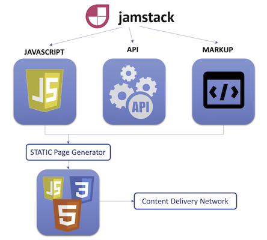
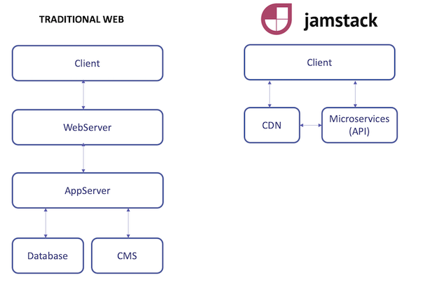
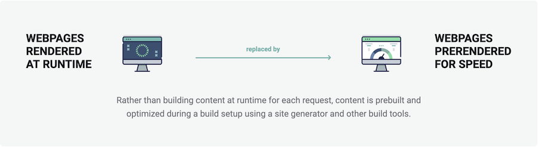
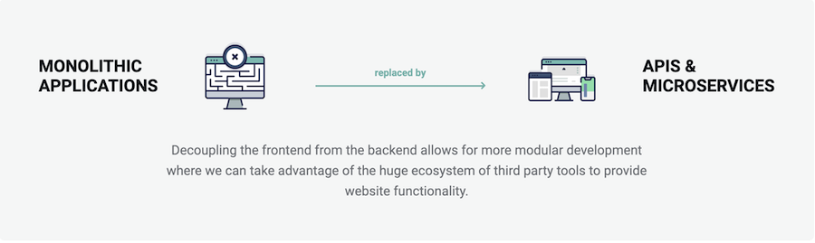
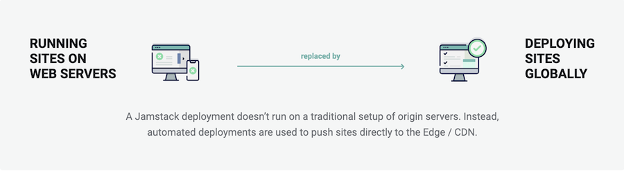
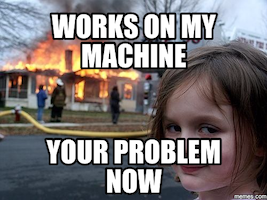
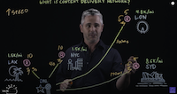
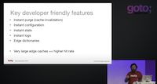

# What is the JAM Stack ? 

🏠 [Table of Contents](./README.md#%EF%B8%8F-table-of-contents) > 📚 **[What is the JAMStack](#)** | ***next=>**  ⚒️ [Setup and deploy your first app](./README_step00.md)*

If you are already familiar with **JAMStack** and just want to move on to the first exercise go to the next section => *[Setup and deploy your first app](./README_step00.md)*. Otherwise, read on.

1. [Introduction to the JAMStack](#1-introduction-to-the-jamstack)
2. [Why this is cool ?](#2-why-this-is-cool-)
3. [Want to learn more ?](#3-want-to-learn-more-)

## 1. Introduction to the JAMStack

> *Sources [JamStack.org](https://jamstack.org/) and [Netlify Documentation](https://www.netlify.com/jamstack/)*

Jamstack is the new standard architecture for the web. Using Git workflows and modern build tools, pre-rendered content is served to a CDN and made dynamic through APIs and serverless functions. Technologies in the stack include JavaScript frameworks, Static Site Generators, Headless CMSs, and CDNs.

**🔵 Javascript:** can represent any modern Javascript/Typescript framework like `React`, `Vue`, or `Angular` or even vanilla JS.

<table>
 <tr>
  <td></td>
  <td> </td>
  <td></td>
  </tr>
</table>

 

**🔵 API:** is a backend serving real time data through either REST or GraphQL, endpoints to interact with fetch, ajax,axios

<table>
 <tr>
  <td>
   
  </td>
  <td>
   
  </td>
  </tr>
</table>

 

**🔵 Markup:** can be either plain old HTML or static content like markdown. This is the nature of markup that will determine the static page generator technology

<table>
 <tr>
  <td>
   
  </td>
  <td>
   
  </td>
  </tr>
</table>

 

**🔵 Static page generator:** You can find a pretty exhaustive list [here](https://jamstack.org/generators/). Most commonly used are Gatsby|Hugo|Jekyll for markdown files and [NextJS](https://nextjs.org/) for pure React.

<table>
 <tr>
   <td></td>
  <td></td>
  <td></td>
  <td></td>
  </tr>
</table>

 

**🔵 Pre-rendering AND Decoupling:** The core principles of **pre-rendering**, and **decoupling**, enable sites and applications to be delivered with greater confidence and resilience than ever before.

**🔵 Before vs after** 

**🔵 Pre-rendering:** 

**🔵 Decoupling:** 

**🔵 Move to CDN:** 

## 2. Why this is cool ?

### 🔐 2.1 - Security

> *Do you remember `/wp-admin.php` ? Me too.* The elder Cedrick

The Jamstack removes multiple moving parts and systems from the hosting infrastructure resulting in fewer servers and systems to harden against attack.

Serving pages and assets as pre-generated files allows **read-only hosting** reducing attack vectors even further. Meanwhile dynamic tools and services can be provided by vendors with teams dedicated to securing their specific systems and providing high levels of service.

### 🌐 2.2 - Scalalibility

> *Have you ever Ddos Amazon CloudFront ? Neither have I* the elder Cedrick.

When sites can be served entirely from a CDN there is no complex logic or workflow to determine what assets can be cached and when.

With Jamstack sites everything can be cached in a content delivery network. With simpler deployments, built-in redundancy and **incredible load capacity.**

### 🚀 2.3 - Performance

Page loading speeds have an impact on user experience and conversion. Jamstack sites remove the need to generate page views on a server at request time by instead generating pages ahead of time during a build.

With all the pages are already available on a CDN close to the user and ready to serve, very high performance is possible without introducing expensive or complex infrastructure.

### 🆘 2.4 - Maintainability

When hosting complexity is reduced, so are maintenance tasks. A pre-generated site, being served directly from a simple host or directly from a CDN does not need a team of experts to "keep the lights on".

The work was done during the build, so now the generated site is stable and can be hosted without servers which might require patching, updating and maintain.

### 📦 2.5 - Portability

Jamstack sites are pre-generated. That means that you can host them from a wide variety of hosting services and have greater ability to move them to your preferred host. Any simple static hosting solution should be able to serve a Jamstack site.

Bye-bye infrastructure lock-in.

### 💡 2.6 - Developer Experience

Let us show you this one today

## 3. Want to learn more ?

<table>
 <tr>
  <td colspan="2">☁️ <b>Content Delivery Network (CDN)</b>
  </td>
 </tr>
 <tr>
   <td></td>
   <td><a href="https://www.youtube.com/watch?v=Bsq5cKkS33I">
    What is Content Delivery Network</a>
     Ryan Sumner (4:32 min)</td>
 </tr>
 <tr>
  <td></td>
   <td><a href="https://www.youtube.com/watch?v=farO15_0NUQ">What is a CDN and why Developers should Care about using one (GOTO 2016)</a> Artur Bergman (32:10min)<a></td>
 </tr>
</table>

**Click** below to move to the next section.

🏠 [Table of Contents](./README.md#%EF%B8%8F-table-of-contents) > 📚 **[What is the JAMStack](#)** | ***next=>**  ⚒️ [Setup and deploy your first app](./README_step00.md)*