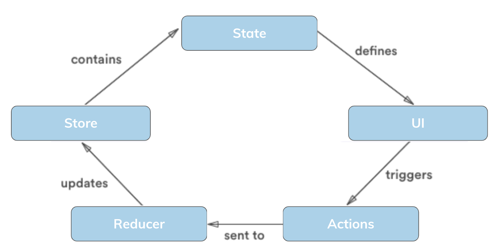
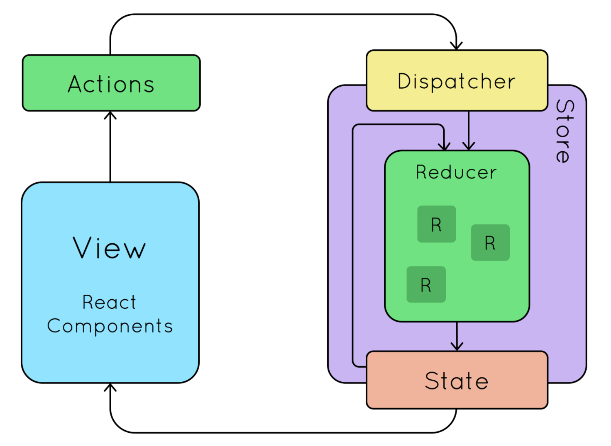
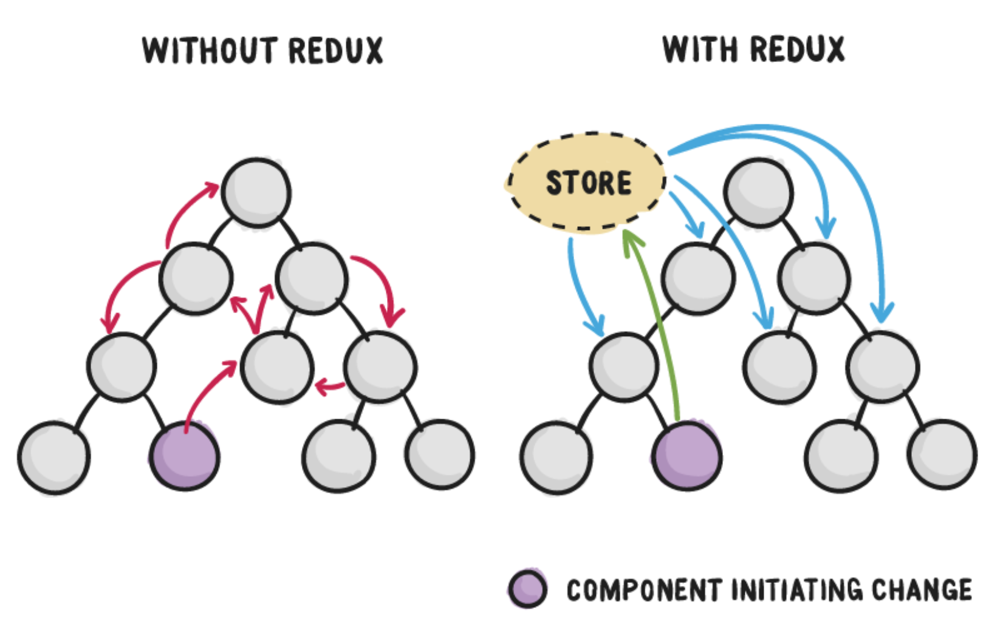
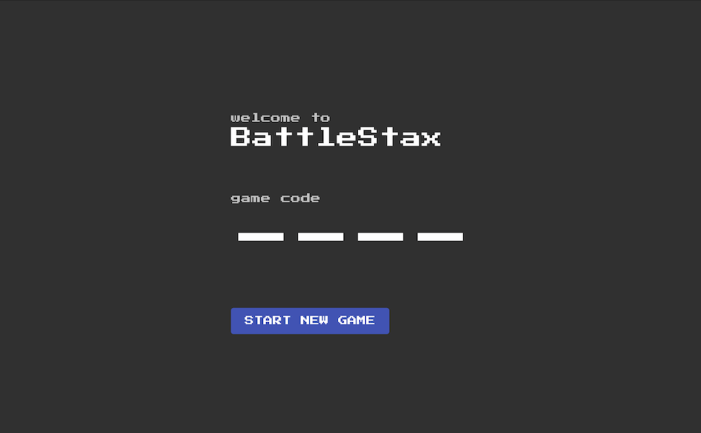
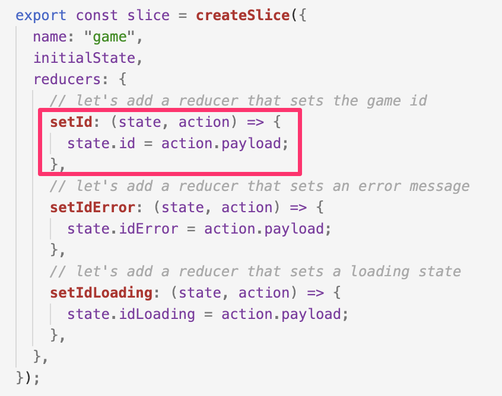
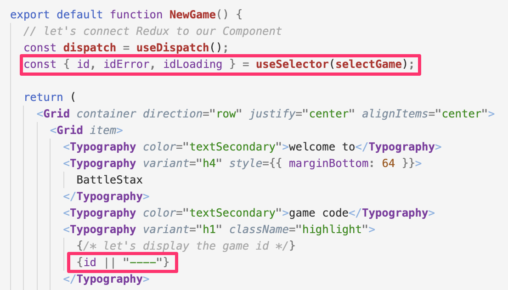

# 📚 What are Redux and React

🏠 [Table of Contents](./README.md#%EF%B8%8F-table-of-contents) > 📚 **Step3 - [What are Redux and React](#)**

If you are already familiar with **Redux and React** and just want to move on to the next exercise go to section ⚒️ [=> Create client State with Redux](./README_step03.md). Otherwise, read on.

**We will cover:**

1. [What is Redux ? ](#1-what-is-redux-)
2. [What is React ?](#2-what-is-react-)
3. [How do they work together ?](#3-how-do-they-work-together-)
4. [Why this is cool ?](#4-why-this-is-cool-)
5. [How does this work in our application ?](#5-how-does-this-work-in-our-application-)
6. [Want to learn more ?](#6-want-to-learn-more-)

---

## 1. What is Redux ? 

Redux is a JavaScript library that is used mostly for application state management. To summarize it, Redux maintains the state of an entire application in a single immutable state tree (object), which can’t be changed directly. When something changes, a new object is created (using actions and reducers). 

It has a global state provider which is known as store which contains the entire state logic of your application.This has a huge advantage in the sense that there is a single source of truth for state and it is globally accessible throughout your application.

## 2. What is React ? 

React is a fast, component-based, front-end JavaScript library. React typically runs in your browser and renders single-page web application user interfaces

React breaks web elements down into re-usable components making it easy to manage complex web interfaces. 

It provides two major mechanisms for providing data to components: props and state. Props are read-only and allow a parent component to pass attributes to a child component. State is local and encapsulated within the component and can change at any time in the component’s lifecycle.

Since state is a very powerful mechanism for building dynamic React apps, proper state management is paramount.

## 3. How do they work together ?

Before we start, here is a very quick intro to how React and Redux work together.

The Redux Store keeps the application state. This state can be updated by dispatching actions. An action is nothing more than a JSON object with a type and some parameters (e.g., { type: ‘SET_DATE’, date: ‘2017-03-15T13:24:00.000Z’ }). The store has a reducer, which, taking into account the action and the previous state, will produce the next state.

React lets you build components that react to changes of the application state. Components affected by a state change are re-rendered with the new data. Components also dispatch actions, for example when a button is clicked.

## 4. Why this is cool ?

Whenever Redux is involved, React container components don’t communicate directly between each other by passing in callbacks and props down the tree.
This is the rough flow proposed by Redux:
1. Components are given callback functions as props, which they call whenever a UI event happens.
2. Those callbacks create and dispatch actions based on the event.
3. Reducers process the actions, computing the new state.
4. The new state of the whole application goes into a single store.
5. Components receive the new state as props and re-render themselves where needed.

## 5. How does this work in our application ?

In our app when we click the button to generate a game id.

 When we do this, Redux uses a simple function (reducers) to take the current state and the new game id, and make them the same. 

 
 Our NewGame react component listens for state changes, and the UI changes accordingly.

 

## 6. Want to learn more ?

1. 🎥 [Learn React Redux With React Hooks (2020)](https://www.youtube.com/watch?v=rcOcYdoz8o8)
2. 🎥 [Redux For Beginners | React Redux Tutorial](https://www.youtube.com/watch?v=CVpUuw9XSjY)
3. 📄 [The only introduction to Redux (and React-Redux) you’ll ever need](https://medium.com/javascript-in-plain-english/the-only-introduction-to-redux-and-react-redux-youll-ever-need-8ce5da9e53c6)
4. 📄 [How to setup Redux with React (2020)](https://medium.com/coox-tech/how-to-setup-redux-with-react-2020-adb8cad90234)
5. 📄 [A beginner’s guide to Redux with React](https://medium.com/@bretcameron/a-beginners-guide-to-redux-with-react-50309ae09a14)

---
🏠 **Back** to [Table of Contents](./README.md#%EF%B8%8F-table-of-contents) or **move** to the next section **=>** ⚒️ [Create client State with Redux](./README_step03.md)
