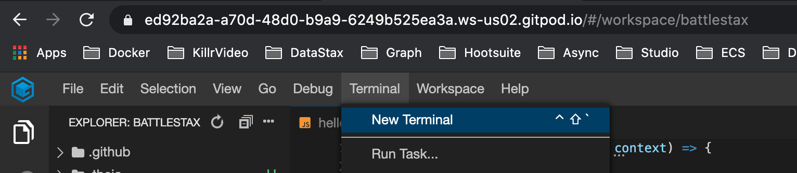
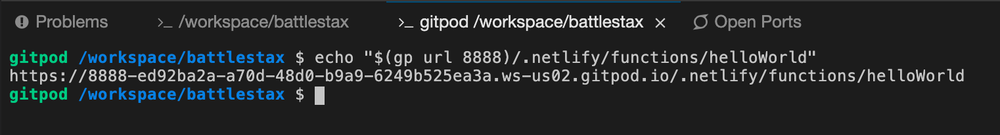
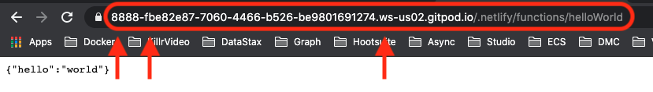

# ⚒️ Expose your "hello world" API 

[](http://www.apache.org/licenses/LICENSE-2.0)
[](https://discord.com/widget?id=685554030159593522&theme=dark)
[](https://github.com/DataStax-Academy/battlestax/actions) 
[](https://app.netlify.com/sites/battlestax-tutorial/deploys)

🏠 [Table of Contents](./README.md#%EF%B8%8F-table-of-contents) > 📚 [What can Netlify do for you](#README_Netlify.md)> ⚒️ **[Expose your "hello world" API](#)**

**Objectives**

The REST API is `stateless`, and therefore helps functions scale horizontally. Here we will:
* Create test cases to check that our API call is working correctly
* Build the API call to Astra to create a game document, based on the requirements from our test


**What we will cover:**

1. [Setup your environment](#1-setup-your-environment)
2. [Make a serverless endpoint using Netlify functions](#2-make-a-serverless-endpoint-using-netlify-functions)
3. [Merge back to master](#3-merge-back-to-master)
4. [Check your deployment in Netlify](#4-check-your-deployment-in-netlify)

---

## 1. Setup your environment

**✅ Step 1a: Launch IDE**

***IMPORTANT!** Don't forget to save when making code changes in your IDE or you might not get expected results.*

*To code during the workshop you can either use **your laptop** or a **Cloud-based IDE** named [Gitpod](gitpod.io) with everything installed. **Here we explain the Gitpod way**.*

### Option A - cloud-based GitPod *(recommended)*

|**✅ Step A. Launch gitpod**<br/>|
|:---|
||
|<details><summary><i>Click to view the solution</i></summary><br/> ✔ Gitpod is a cloud based IDE based on Eclipse Theia very similar to VSCode. You need to authenticate with your github account but then GitPod will initialized you workspace, building the solution.To initialize your environment click on the button below (CTRL + Click to open in new tab)<br/>[](https://gitpod.io/from-referrer/)<br/><br/>✔ At initialization gitpod has download dependencies already (you should have the `node_modules` folder already there.<br/><br/>Target urls are dynamic and look like `https://<your_uid>.<your_region>.gitpod.io/#/workspace/battlestax`<br/></details>|

# OR

### Option B - LOCAL development environment

*To code during the workshop you can either use **your laptop** or a **Cloud-based IDE** named Gitpod. **Here we explain how to work locally**.*

```diff
+ Information : We assume people working locally are not beginners
+ They should be autonomous to install a development environment.
```

Here is the list of tools you need:
- [NodeJS 12.x+](https://nodejs.org/en/download/)
- [Git](https://git-scm.com/book/en/v2/Getting-Started-Installing-Git)
- An IDE like [Visual Studio Code](https://code.visualstudio.com/Download) or [Jetbrain WebStorm](https://www.jetbrains.com/webstorm/download/#section=mac) or [Atom](https://atom.io/)


|**✅ Step B. Clone the repository**|
|:---|
||
|<details><summary><i>Click to view the solution</i></summary><br/> ✔  Clone **_your_** `BattleStax` repository to localhost, use the following command in your terminal to do so:<br/><br/>📘 **Command to execute**<br/>`git clone git@github.com:[your_github_id]/battlestax.git`<br/><br/>✔  Move to the proper directory<br/><br/>📘 **Command to execute**<br/>`cd battlestax`<br/><br/> ✔ Install Battlestax Dependencies. These are specified in the `package.json` file.<br/><br/>📘 **Command to execute**<br/>`npm install`</details>|

**✅ Step 1b: Configure default remote**

We just need to configure the default remote once. Run the below command to set your configuration.

📘 **Command to execute**

`git config checkout.defaultRemote origin`</br>

**✅ Step 1c: Checkout expected branch**

1. Switch to branch `step-1`
* For this part of the tutorial, we will be working in step-1 branch. Switch branches by using the following command in the terminal. 

📘 **Command to execute**

`git checkout step-1`

### [🔝](#%EF%B8%8F-table-of-contents)

## 2. Make a Serverless endpoint using Netlify functions

**✅ Step 2a: Check out the `functions` folder**

Each file in our `functions` folder represents a REST API endpoint implemented as a **serverless** function _(we'll get to this in a moment)_. For now, take a look at the `helloWorld.js` file inside the `functions` folder.


At this point, this REST API endpoint is stubbed out. You'll need to fill it out with the code below. If we use this as it, it will simply give us back `{"hello":"world"}`. 

📘 **Code to copy**

```javascript
exports.handler = async (event, context) => {
  return {
    statusCode: 200,
    body: JSON.stringify({ hello: "world" }),
  };
};
```

*Feel free to change "world" to something creative. We'll use this later in our unit test and to check our production endpoint.*

**✅ Step 2b: Test the REST API with a browser**

📘 **Command to execute**

`npm run dev`
* This will give you the UI and run the `helloWorld` function in the background.

### GitPod

Since we started the application in the foreground, we'll need to open another terminal window in GitPod to execute the next command. To do so, navigate to **`Terminal`** in the toolbar and choose **`New Terminal`** from the dropdown.



Using your new terminal, execute the following command to get your helloWorld endpoint then copy and paste the endpoint URL into your browser.

📘 **Command to execute**

`echo "$(gp url 8888)/.netlify/functions/helloWorld"`
* This will give you the GitPod endpoint for access to your "helloWorld" function



* See the end point at: `https://8888-<your_uid>.<your_region>.gitpod.io/.netlify/functions/helloWorld`

*_Notice the port, GitPod generated ID, and the GitPod region in the URL below at each arrow. This should automatically be generated for you when you run `npm run dev`. Just paste `/.netlify/functions/helloWorld` on to the end in order to get to the correct endpoint if for some reason the above command is not working for you._*

📗 **Expected output**



### LOCAL

* See the end point at: `localhost:8888/.netlify/functions/helloWorld`

### You should see this output at the endpoint
`{"hello":"world"}`

This is our **serverless** function giving us back the "Hello World" example.

**✅ Step 2c: Run the existing unit tests**

✔️ Have a look at the `/test/helloWorld.test.js` file, this does not do much at this point. This basically tests the `helloWorld` function to ensure that we get "world" in our response, and hence we would know that the function is working correctly.

✔️ The way we are going to approach writing our tests is by asking the question "What does our endpoint need to do?". We want our function to 
create a new game on Astra (provision a new game) --  and we provide the API with a random game code so this can work.

```javascript
const insertGame = require("../functions/insertGame");

it("should return a JSON response", async () => {
  const response = await insertGame.handler();
  const responseJson = JSON.parse(response.body);
  expect(responseJson.hello).toBe("world");
});
```

*Note that the above test must match the expected output of your actual function. If you used something other than "world" you will need to change it here or your test will fail.*

Run the test to try it out:

📘 **Command to execute**

```bash
npm run test:functions
```
### [🔝](#%EF%B8%8F-table-of-contents)

## 3. Merge back to master

**✅ Step 3a. Commit changes back to GitHub**

Now that we've updated our code we need to push these changes back to master and kick off an automated deploy in Netlify. We'll do this by committing our changes locally, pushing them up to our repository, then creating a pull request to merge them back to master.

📘 **Commands to execute**

`git add functions/helloWorld.js test/helloWorld.test.js`<br/>
`git commit -m "Merging step1 into master"`<br/>
`git push`<br/>

Once you've pushed your changes go back to your repository in GitHub and create a pull request to merge our step-1 branch changes into master. **_Ensure that you are merging back into your YOUR master branch_**.

**✅ Step 3b. Create a GitHub pull request for your helloWorld changes**

Using `Github UI`, merge your new branch to the master using a pull request.

✔️ Select the master branch in github
>

✔️ Click and `Compare & Pull request` button. for `step-1` into `master`.
>

✔️ Caution don't target the original master from DataStax-Academy but **YOUR** master
>

✔️ Provide a comment and click `Create Pull Request`
>

✔️ Once your tests have passed, click on `Merge Pull Request`
>

✔️ Click on `Confirm Merge`
>

Congratulations you are done, it should look something like this
>

### [🔝](#%EF%B8%8F-table-of-contents)

## 4. Check your deployment in Netlify
At this point you should see that your pull request kicked off a **Deploy Preview** in Netlify. Once all tests have passed you can confirm your merge. 

**✅ Step 4a. Confirm your deployment**

✔️ Browsing `Netlify`, navigate to **`Deploys`**, and see the CI/CD process rolling with our deployments
>

Click on any items in the deploy list to see logs and other useful information about your deployments
>

Once completed **Netlify** will automatically push the confirmed changes into production. No need to manually deploy anything separately, just push into your repo and production happens.

Finally, you can check that your new `helloWorld` function is deployed and accessible from production.

**✅ Step 4b. Confirm your serverless helloWorld endpoint on the internetz**

Now that we've sucessfully deployed your **helloWorld** serverless function simply by merging back to **master** in GitHub, we should check that it's actually there and working.

✔️ In **`Netlify`**, navigate to **`Functions`** in the toolbar, then click the **`helloWorld`** function in the list.
>

✔️ Copy the function endpoint from the browser window and paste into a new tab.

>

📗 **Expected output**
>

Ok, that was arguably a lot of stuff, but we wanted to break down the process at least once. It might feel like a lot of steps on the first couple runs, but as you get used to it the flow becomes quite natural.

* make changes to your branch
* push those changes back to GitHub
* use a pull request to merge the changes back to master
* CI/CD automatically checks your application using GitHub actions and the Netlify integration
* confirm merge
* changes are automatically pushed to production

In the future, we won't break it down quite so much, but feel free to use this section as a reference as we move forward.

Before moving on, take a moment to let this sink in. You just deployed an app with a serverless function to production over a globally supported CDN using a full CI/CD pipeline all by merging your code into master. Boom!

### [🔝](#%EF%B8%8F-table-of-contents)

---
🏠 **Back** to [Table of Contents](./README.md#%EF%B8%8F-table-of-contents) or **move** to the next section **=>** 📚 [What are DataStax Astra and Stargate](./README_Astra_Stargate.md)

