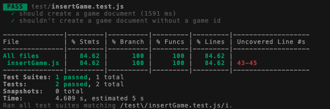

# ⚒️ Implement a CRUD Api in Astra

[](http://www.apache.org/licenses/LICENSE-2.0)
[](https://discord.com/widget?id=685554030159593522&theme=dark)
[](https://github.com/DataStax-Academy/battlestax/actions)
[](https://app.netlify.com/sites/battlestax-tutorial/deploys)

🏠 [Table of Contents](./README.md#%EF%B8%8F-table-of-contents) > 📚 [What is DataStax Astra and Stargate](./README_Astra_Stargate.md) > ⚒️ **[Connect to your Astra database](#)**

**Objectives**

The REST API is `stateless`, and therefore helps functions scale horizontally. 

In step 2 of the Battlestax tutorial, we will:
- Create an Astra database to store game documents
- Create test cases to check that our API call is working correctly
 - Build the API call to Astra to create a game document, based on the requirements from our test


**We will cover:**

1. [Create your Astra instance](#1-create-your-astra-instance)
2. [Setup your environment](#2-setup-your-environment)
3. [Creating the `insertGame` Netlify endpoint](#3-creating-the-insertgame-netlify-endpoint)
4. [Connect to Astra](#4-connect-to-astra)
5. [Hook it all together](#5-hook-it-all-together)
6. [Running TDD tests](#6-running-tdd-tests)
7. [Merge back to master](#7-merge-back-to-master)
7. [Verify your deployment in Netlify](#8-verify-your-deployment-in-netlify)

One of the first things we need to do is hook up the "plumbing" of our application to talk to our back-end services, namely, our Cassandra database with **Astra** and **Netlify**. Once this is in place, we are connected and ready to go with the services we need to power our app.

We will also be making use of the Document API to connect to our **Astra** database. The **Stargate** API framework allows developers the freedom to access **Astra** with a variety of APIs, the Document API being one. With the Document API, you can save and search schemaless JSON documents in Cassandra. No need to use SQL, CQL, or any database drivers to talk to the data layer. Just code and move on.

_ehem...for those of you familiar with Apache Cassandra, yes, I just said you could skip data modeling._


For a **FULL** code solution to this section **`right-click`** the image below and choose **`Open Link in New Tab`**.

[](https://github.com/DataStax-Academy/battlestax/pull/2/files)

**_Don't forget to SAVE your changes or enable autosave in GitPod._**

---

## 1. Create your Astra instance

`ASTRA` service is available at url [https://astra.datastax.com](https://dtsx.io/workshop). `ASTRA` is the simplest way to run Cassandra with zero operations at all - just push the button and get your cluster. `Astra` offers **5 Gb Tier Free Forever** and you **don't need a credit card** or anything to sign-up and use it. 

|**✅ Step 1a. Register (if needed) and Sign In to Astra** :<br/>|
|:---|
||
|<details><summary><i>🖱️ Click me to show details</i></summary><br/>You can use your `Github`, `Google` accounts or register with an `email`.<br/>Make sure to chose a password with minimum 8 characters, containing upper and lowercase letters, at least one number and special character<br/><br/>- [Registration Page](https://dtsx.io/workshop)<br/><br/><br/>- [Authentication Page](https://dtsx.io/workshop)<br/><br/></details>|

|**✅ Step 1b. Choose the free plan and select your region**<br/>|
|:---|
||
|<details><summary><i>🖱️ Click me to show details</i></summary><br/><br/>- **Select the free tier**: 5GB storage, no obligation<br/>- **Select the region**: This is the region where your database will reside physically (choose one close to you or your users). For people in EMEA please use `europe-west1` idea here is to reduce latency.<br/></details>|

|**✅ Step 1c. Configure and create your database**<br/>|
|:---|
||
|<details><summary><i>🖱️ Click me to show details</i></summary><br/>You will find below which values to enter for each field.<br/><br/><br/>- **Fill in the database name** - `battlestax_db.` While Astra allows you to fill in these fields with values of your own choosing, please follow our reccomendations to make the rest of the exercises easier to follow. If you don't, you are on your own! :)<br/>- **Fill in the keyspace name** - `battlestax`. It's really important that you use the name sa_index here in order for all the exercises to work well. We realize you want to be creative, but please just roll with this one today.<br/>- **Fill in the Database User name** - `battle_user`. Note the user name is case-sensitive. Please use the case we suggest here.<br/>- **Fill in the password** - `battle_password1`. Fill in both the password and the confirmation fields. Note that the password is also case-sensitive. Please use the case we suggest here.<br/>- **Create the database**. Review all the fields to make sure they are as shown, and click the **`Create Database`** button.<br/><br/>You will see your new database `Pending` in the Dashboard.<br/><br/><br/>The status will change to `Active` when the database is ready, this will only take 2-3 minutes. You will also receive an email when it is ready.<br/></details>|

## 2. Setup your environment

**✅ Step 2a: Checkout expected branch**

1. Switch to branch `step-2`
* For this part of the tutorial, we will be working in step-2 branch. Switch branches by using the following command in the terminal

📘 **Command to execute**

`git checkout step-2`

**✅ Step 2b: Set environment variables in code**

In the ["hello world"](./README_step01.md) section, we pushed a simple helloWorld "test" function to get a feel for how things work. Now, we are going to start working with the "real" code to get our game working. To do this, we need to set a group of environment  variables referring to the database we just created with **DataStax Astra**, not only in our code, but across **GitHub** and **Netlify** as well.

Why are we doing this, you might ask? Because as part of our **CI/CD** pipeline our tests will attempt to connect to our data layer to ensure everything is hooked up and working. Not only that, but once you deploy your application to **Netlify** it will use these variables to hook up your production app and power your serverless functions. 

We set these all **ONE** time and that's it, you are ready to go. With that, let's do it.

First things first, we need to get the values we are going to use for our variables. This section might look like a lot, but honestly, it's just a bunch of copy/paste.

✔  Go back to the **Astra** UI and click on the database you just created to get the details page.


🟢 `ASTRA_DB_USERNAME` as `battle_user` *(The user name we defined when creating the Astra instance)*

🟢 `ASTRA_DB_PASSWORD` as `battle_password1` *(The password we defined when creating the Astra instance)*

🟢 `ASTRA_DB_KEYSPACE` as `battlestax` *(The keyspace we defined when creating the Astra instance)*

🟢 `ASTRA_DB_ID` as the cluster ID of your Astra DB. To get your database ID and region go the ASTRA summary page. Locate the cluster ID and copy it by clicking the clickboard icon as shown above. 

🟢 `ASTRA_DB_REGION` as the region you picked when creating the DB, It should be either `us-east1` or `europe-west1`.

🟢 `GAMES_COLLECTION` as `games` (this is the collection where we will store all values)

**Now, take these values and apply them to the following sections. You will use each one more than once FYI.**

_The following instructions are the same whether using GitPod or a local IDE._

✔  Ensure that you are in the ??battlestax??? directory

✔  Copy and paste the contents of the `.env.template` file into an `.env` file:

📘 **Command to execute**

`cat .env.example > .env`

✔ The `.env` file allows us to customize our own environmental variables. We set our Astra credentials to env variables, which are outside of our program. Fill in the `.env` file variables with the Astra variables you made a copy of above:

**_If you used different values for your database you will need to use those instead, otherwise just use the values we've provided._**

`ASTRA_DB_USERNAME=battle_user`<br/>
`ASTRA_DB_PASSWORD=battle_password1`<br/>
`ASTRA_DB_KEYSPACE=battlestax`<br/>
`ASTRA_DB_ID=[the value you retrieved above from YOUR database]`<br/>
`ASTRA_DB_REGION=[the value you retrieved above from YOUR database]`<br/>
`GAMES_COLLECTION=games`


**✅ Step 2c: Set environment variables _(secrets)_ in GitHub for CI/CD**

Every application should have a CI/CD *(**C**ontinuous **I**ntegration, **C**ontinuous **D**eployment)* pipeline. This allows for quick iteration of changes to production deployment by taking advantage of automation and tests to ensure everything is working properly. 

After each commit a workflow is initialized to BUILD your project, EXECUTE tests and DEPLOY to **Netlify**.  The good thing is many **CI/CD** tools are provided right within **GitHub**. Adding this capability just takes a couple steps.

✔ Within **YOUR** Battlestax repository in **GitHub** click on **`Settings`** in the top toolbar, choose **`Secrets`** from the menu on the left, and finally click the **`New secret`** button on the top right of the page. Add a secret for each of the variables we used earlier.

`ASTRA_DB_USERNAME=battle_user`<br/>
`ASTRA_DB_PASSWORD=battle_password1`<br/>
`ASTRA_DB_KEYSPACE=battlestax`<br/>
`ASTRA_DB_ID=[the value you retrieved above from YOUR database]`<br/>
`ASTRA_DB_REGION=[the value you retrieved above from YOUR database]`<br/>
`GAMES_COLLECTION=games`

*This should look like:*


**✅ Step 2d: Set environment variables in Netlify**

✔ Go back to **Netlify** and navigate to **`Site settings`** in the toolbar, then choose **`Build & deploy`** from the menu on the left.

>

✔ Scroll down to the **`Environment variables`** section and choose **`Edit variables`**.

>

✔ Click `New variable` to add each key/value pair, one for each variable listed below.

`ASTRA_DB_USERNAME=battle_user`<br/>
`ASTRA_DB_PASSWORD=battle_password1`<br/>
`ASTRA_DB_KEYSPACE=battlestax`<br/>
`ASTRA_DB_ID=[the value you retrieved above from YOUR database]`<br/>
`ASTRA_DB_REGION=[the value you retrieved above from YOUR database]`<br/>
`GAMES_COLLECTION=games`

You should now have something like:


✔ Once complete click **`Save`** and you are good to go.

You don't have to do that ever again, we promise. From now on anytime you deploy everything should be hooked up to your data layer and ready to go through to production.

### [🔝](#)

## 3. Creating the `insertGame` Netlify endpoint

Now that we have **ALLLLL** of our environment vars set and our game document store, let's start building our basic `insertGame` serverless function, in the `function/insertGame.js` file. 

First, we need to declare `gameId` and `gamePayload` variables. We know each game is associated with it's own unique game id, and during game play we can anticipate getting a payload from the user.

📘 **Code to copy**

```javascript
// let's return a 400 if we don't recieve a valid game id
let gameId;
let gamePayload;
```

From Netlify, you get your `gameId` parameter from the path of the incoming REST call, and parse our event body that is associated with it as the `gamePayload`.
By default, Netlify puts your function at the path `/.netlify/function/insertGame`.

📘 **Code to copy**

```javascript
// let's set the game id
gameId = event.path.split("insertGame/")[1];
// let's parse the incoming payload
gamePayload = JSON.parse(event.body);
```

Let's not forget about error handling. If we cannot parse the game id or body from the incoming REST call, a HTTP status code of `400` will be returned and you will get an error message

📘 **Code to copy**

```javascript
...
} catch (e) {
  // let's return a 400 if we can't parse the game id or body
  return {
    statusCode: 400,
    body: JSON.stringify({ message: "must provide a valid game ID" }),
  };
}
```

All this should statisfy our second test ( we need to get valid game id)

### [🔝](#)

## 4. Connect to Astra

The next thing we need to do is to connect to our Astra database. We are first going to import the JavaScript SDK library (`astrajs`) to create our Astra Client. We are going to give the Astra client our environment variable credentials to connect to the database, and create a document to store information about our game.

Go [HERE](https://www.npmjs.com/package/@astrajs/collections) for more information on the on the JavaScript SDK library.

📘 **Code to copy**

``` javascript
// let's connect to Astra
const astraClient = await createClient({
  // let's set our Astra connection configuration
  astraDatabaseId: process.env.ASTRA_DB_ID,
  astraDatabaseRegion: process.env.ASTRA_DB_REGION,
  username: process.env.ASTRA_DB_USERNAME,
  password: process.env.ASTRA_DB_PASSWORD,
});

const gamesCollection = astraClient
  .namespace(process.env.ASTRA_DB_KEYSPACE)
  .collection(process.env.GAMES_COLLECTION);
```
### [🔝](#)

## 5. Hook it all together

Finally, we are going to try to take all our configuration infomation stored in `gamesCollection` and provision a new game from it. If it works, we get back a HTTP status code of `200`. If it fails, we will get back a `500`. This should statify both test 1 and test 2.

📘 **Code to copy**

```javascript
  // let's provision a new game
  try {
    // let's create a new game with the gamesCollection
    const res = await gamesCollection.create(gameId, gamePayload);
    // let's return a 200 with the resoponse from astra
    return {
      statusCode: 200,
      body: JSON.stringify(res),
    };
  } catch (e) {
    console.error(e);
    // let's return a 500 on error
    return {
      statusCode: 500,
      body: JSON.stringify(e),
    };
  }
};
```

For a **FULL** code solution to this section **`right-click`** the image below and choose **`Open Link in New Tab`**.

[](https://github.com/DataStax-Academy/battlestax/pull/2/files)

## 6. Running TDD tests

The way we approach testing is by asking the question "What does our endpoint need to do?". We want our serverlesss function to provision a new game on Astra -- and we need provide the API with a random game code so this can work. Our endpoint needs to:

* Tell the API to make the game document
* It should not be able to make a game document if we don't give it a valid game id
* If we get a 500 on error (something goes wrong), we should be informed

We are provided with test cases `test/insertGame.test.js` that will check for these actions working in `functions/insertGame.js`. Notice that `insertGame` is required as a dependency in our test.js file.

We are going to use `faker.js`, a JavaScript library for generating mock data. This mock data is useful when building and testing our application. Hence, we should `require` the faker library.

```javascript
const faker = require("faker");
```

✔️  _TEST 1_: Our API should make the game document. We need to test to see if the `insertGame` function actually does that:

```javascript
const gameId = faker.helpers.replaceSymbols("????");

it("should create a game document", async () => {
  const response = await insertGame.handler({
    path: "/functions/insertGame/" + gameId,
    body: '{"user":"me"}',
  });
  expect(response.statusCode).toBe(200);
});
```

We use a simple async function to do this. `faker.helpers.replaceSymbols("????")` will create a sample game id for the path, and some user data in the
body. As successful test run will return a `200`.

✔️  _TEST 2_ : Our function must not be able to create a game document with a valid game id
```javascript
it("shouldn't create a game document without a game id", async () => {
  const response = await insertGame.handler({ path: "insertGame" });
  expect(response.statusCode).toBe(400);
});
```
We ensure that our function cannot go ahead and create a game, unless it has been provided with a valid game id.

Now let's run our tests to see if our function works.

📘 **Command to execute**

```bash
npm run test:functions
```

📗 **Expected output**



### [🔝](#)

## 7. Merge back to master

Now that we've updated our code we need to push these changes back to master and kick off an automated deploy in Netlify.

📘 **Commands to execute**

```bash
git add functions/insertGame.js
git commit -m "Merging step2 into master
git push
```

### [🔝](#)

## 8. Verify your deployment in Netlify

✔️  When your new site is ready, you will be able to go to: `<your_url>.netlify.app` to see your game.


If you start new games it will create a new record in the database. If you want to validate this behavirour click on `START NEW GAME`.

✔️  Open Astra UI, show the `CQL Console` and execute the following command (here *battlestax* is your keyspace and *games* your collection name - if you chose another names adapt the query accordingly).

📘 **Command to execute**

`SELECT key, text_value FROM battlestax.games;`

You should have a result that looks like:


### [🔝](#)

Great job! Let's move to the next section.

---
🏠 **Back** to [Table of Contents](./README.md#%EF%B8%8F-table-of-contents) or **move** to the next section **=>** 📚 [What is Redux and React](./README_Redux_React.md)
