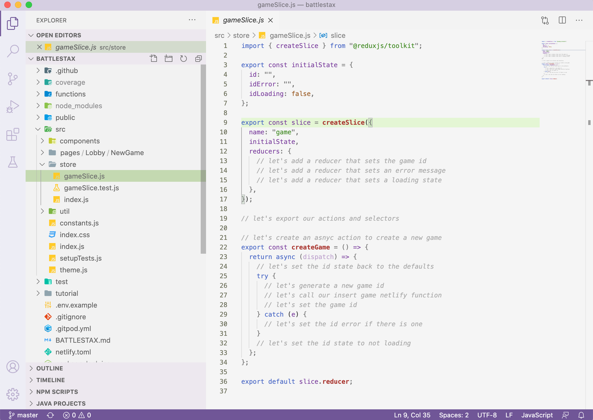
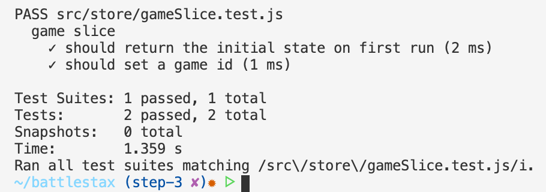

# ⚒️ Create client state with Redux

[](http://www.apache.org/licenses/LICENSE-2.0)
[](https://discord.com/widget?id=685554030159593522&theme=dark)
[](https://github.com/DataStax-Academy/battlestax/actions) 
[](https://app.netlify.com/sites/battlestax-tutorial/deploys)

🏠 [Table of Contents](./README.md#%EF%B8%8F-table-of-contents) > 📚 [What is Redux and React](./README_Redux_React.md) > ⚒️ **[Create client State with Redux](#)**

**Objectives** 

**Redux Tool Kit (RTK)** tremendously simplifies using Redux, elminating most of the issues most people have when using it. We will use RTK for state management on the Client and see how it is working with Astra.

In this **step 3** we will:
- Build out the game slice boilerplate code by implementing one reducer, exporting an action and a selector
- Run tests to try out the functionality of our game slice

**We will cover:**
1. [Setup your environment](#1-setup-your-environment)
2. [Building a `gameSlice`](#2-building-a-gameslice)
3. [Generate an action and a selector](#3-generate-an-action-and-a-selector)
4. [Create an Async Action](#4-create-an-async-action)
5. [Running TDD tests](#5-running-tdd-tests)


An application's state is divided into "slices" that are corresponding to each feature set of the application. 
Game state is saved in Astra and state writes go from the clients to the REST API (Netlify).
Clients read state from the Astra database as well as through the state loop.
The Lobby and Player clients stay connected, as once the state is updated, it will be propagated to all the clients.


For a **FULL** code solution to this section **`right-click`** the image below and choose **`Open Link in New Tab`**.

[](https://github.com/DataStax-Academy/battlestax/pull/7/files)

**_Don't forget to SAVE your changes or enable autosave in GitPod._**

---

## 1. Setup your environment

**✅ Step 1a: Checkout expected branch**

1. Switch to branch `step-3`
* For this part of the tutorial, we will be working in step-3 branch. Switch branches by using the following command in the terminal

📘 **Command to execute**

`git checkout step-3`

### [🔝](#)

## 2. Building a `gameSlice`

Let's use the  Redux Toolkit to build out the game slice that will set the game code as part of the state. Redux Toolkit allows us to write shorter logic that's easier to read, while still following the same Redux behavior and data flow. Open the `src/store/gameSlice.js` file to see skeleton code we have provided to get you started.



Lets discuss some of the parameters in `createSlice`.

* `initialState` - The initial state value for this slice of state.
* `name` - A string name for this slice of state. 
* `reducers` - Functions that determine changes to an application's state. It uses the action it receives to determine this change. Redux relies heavily on reducer functions that take the previous state and an action in order to execute the next state. We will be adding these shortly.

```javascript
export const slice = createSlice({
  name: "game",
  initialState,
  reducers: {
    // let's add a reducer that sets the game id
    // let's add a reducer that sets an error message
    // let's add a reducer that sets a loading state
  },
});
```
**✅ Step 2a: Create the setID reduucer**

First, we need to create a reducer that will allow us to modify the game id: 

📘 **Code to copy**

```javascript
// let's add a reducer that sets the game id
setId: (state, action) => {
  state.id = action.payload;
},
```
**✅ Step 2b: Create the setIdError and setIdLoading reducers**

Next, we need to create some reducers that will allow us to handle the API request changes: 

📘 **Code to copy**

```javascript
// let's add a reducer that sets an error message
setIdError: (state, action) => {
  state.idError = action.payload;
},
// let's add a reducer that sets a loading state
setIdLoading: (state, action) => {
  state.idLoading = action.payload;
},
```

### [🔝](#)

## 3. Generate an action and a selector

Now that we have a reducer, RTK will generate an action and a selector for us. 
* An **action** is functions that call reducers. An action dispatches a state change event, then the reducer gets that event and figures out what to do with it
* A **selector** (`selectId` in our case) is simply a function that accepts Redux state as an argument and returns data that is derived from that state. It is small function you write that can take the entire Redux state, and pick out a value from it. This will be useful in the next step of our app development.

**✅ Step 3a: Export an action and a selector**

Let's export the action and the selector for our game. We can call actions and selector from other places in out code base. This will be useful in the next step of our app development.

📘 **Code to copy**

```javascript
// let's export our actions and selectors
export const { setId, setIdLoading, setIdError } = slice.actions;
export const selectGame = (state) => state.game;
```

### [🔝](#)


## 4. Create an Async Action


Now we need to create an async action that generates a game id and saves it to Astra.

```javascript
// let's create an asnyc action to create a new game
export const createGame = () => {
  return async (dispatch) => {
    // let's set the id state back to the defaults
    try {
      // let's generate a new game id
      // let's call our insert game netlify function
      // let's set the game id
    } catch (e) {
      // let's set the id error if there is one
    }
    // let's set the id state to not loading
  };
};
```

**✅ Step 4a: Set the id state back to the defaults**

📘 **Code to copy**

```javascript
// let's set the id state back to the defaults
    dispatch(setIdLoading(true));
    dispatch(setIdError(""));
    dispatch(setId(""));
```


**✅ Step 4b: Generate a game code and insert it into Astra**

Call the `generateGameId()` from `src/util/random.js` to generate a new game id for us. Then we initialize a new game by inserting the game id into Astra with the `insertGame` function we created in step 2.

📘 **Code to copy**

```javascript
// let's generate a new game id
const gameId = generateGameId();

// let's call our insert game netlify function
const res = await fetch(`/.netlify/functions/insertGame/${gameId}`, {
  method: "POST",
  body: JSON.stringify({ state: "initialized" }),
});
if (!res.ok) {
  throw Error(res.statusText);
}
```      

**✅ Step 4c: Set the game id as part of state**

We call the `setId` reducer to set the game id as part of state. We get the game id from the  JSON response from the REST call, incase the request fails, it won't lead to inconsistancy between Astra and game state.

📘 **Code to copy**

```javascript
// let's set the game id
const resJson = await res.json();
dispatch(setId(resJson.documentId));
```      
While we are at it, let's be sure to handle any potential errors that may arise, and set them as a part of the state.

📘 **Code to copy**

```javascript
// let's set the id error if there is one
      dispatch(setIdError(e.message));
```

**✅ Step 4d: Set id state to not loading**

Once the try block has executed, the id is no longer in a state of loading.

📘 **Code to copy**

```javascript
// let's set the id state to not loading
dispatch(setIdLoading(false));
```

### [🔝](#)

## 5. Running TDD tests

We are provided with test cases `store/gameSlice.test.js` which will test that our slice we created working is in `store/gameSlice.js`. The tests will ensure that `gameSlice.js` does the following:

Have a look at the [src/store/gameSlice.test.js](src/store/gameSlice.test.js) to review these tests.

✔️  _TEST 1_: The slice should return the initial state on first run. It important for our game slice to change state back to the default state before another state change occurs.

```javascript
it("should return the initial state on first run", () => {
  const nextState = initialState;
  const result = reducer(undefined, {});
  expect(result).toEqual(nextState);
});
```

✔️  _TEST 2_ : Naturally, it should beable to set a new game id as part of the state.
```javascript
it("should set a game id", () => {
    const gameId = generateGameId();
    const nextState = reducer(initialState, setId(gameId));
    const rootState = { game: nextState };
    expect(selectGame(rootState).id).toEqual(gameId);
  });
```

✔️  _TEST 3_: If a new game is in the process of loading, the state needs to be made aware of it.

```javascript
it("should set the game id loading flag", () => {
  const gameId = generateGameId();
  const nextState = reducer(initialState, setIdLoading(true));
  const rootState = { game: nextState };
  expect(selectGame(rootState).idLoading).toEqual(true);
});
```

✔️  _TEST 4_: Make sure that if there is an error, it can be set as part of state.

```javascript
it("should set the game id error", () => {
  const nextState = reducer(initialState, setIdError("nope"));
  const rootState = { game: nextState };
  expect(selectGame(rootState).idError).toEqual("nope");
});
```
✔️  _TEST 5_: This test goes through the process of creating a new game to ensure that it works.

```javascript
it("should create a new game", async () => {
  fetchMock.postOnce("*", {
    body: { documentId: "DANG" },
  });
  store.dispatch(createGame());
  const initialState = store.getState();
  expect(selectGame(initialState).idError).toEqual("");
  expect(selectGame(initialState).idLoading).toEqual(true);
  expect(selectGame(initialState).id).toEqual("");
  await new Promise((resolve) => setTimeout(resolve, 500));
  const finalState = store.getState();
  expect(selectGame(finalState).idError).toEqual("");
  expect(selectGame(finalState).idLoading).toEqual(false);
  expect(selectGame(finalState).id).toEqual("DANG");
});
```
**✅ Step 5a: Test the gameSlice**

Now, we can run our tests using `npm test src/store/gameSlice.test.js` to see that we have a functioning game slice.

📘 **Command to execute**

`npm test src/store/gameSlice.test.js`

📗 **Expected output**



## 6. Merge back to master

Now that we've updated our code we need to push these changes back to master and kick off an automated deploy in Netlify.

📘 **Commands to execute**

```bash
git add src/store/gameSlice.js
git commit -m "Merging step3 into master
git push
```

### [🔝](#)

---
🏠 **Back** to [Table of Contents](./README.md#%EF%B8%8F-table-of-contents) or **move** to the next section **=>** [Bind Redux to the User Interface](./README_step04.md)
