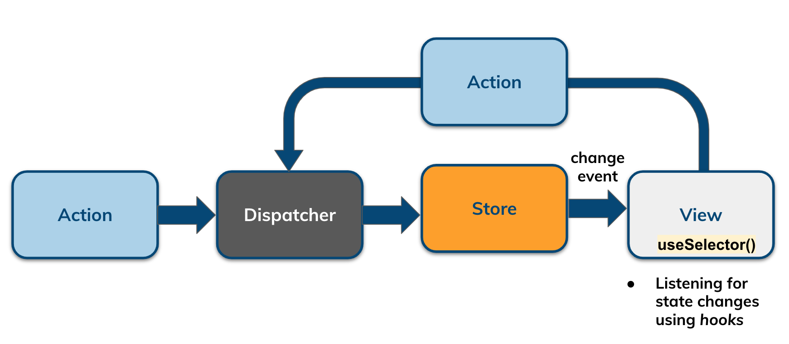
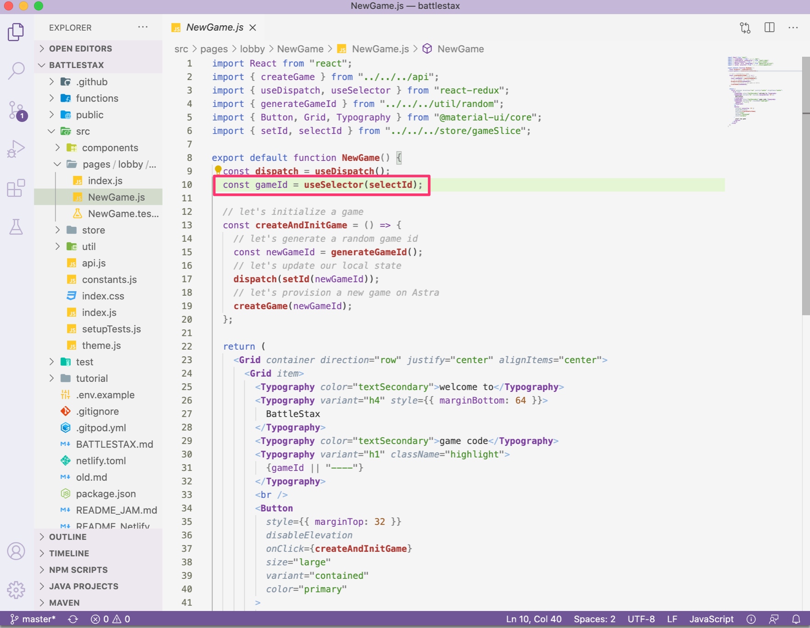
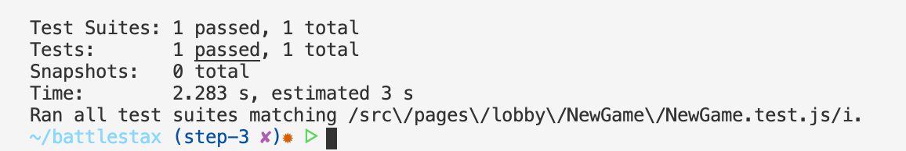

# 04. Connect your UI to your State

[](http://www.apache.org/licenses/LICENSE-2.0)
[](https://discord.com/widget?id=685554030159593522&theme=dark)
[](https://github.com/DataStax-Academy/battlestax/actions) 
[](https://app.netlify.com/sites/battlestax-tutorial/deploys)

⚒️ [Create client State](./README_step03.md) > 📚 [What is React](./README_React.md) > ⚒️ **[Connect your UI to your State](#)** | **next=>**  *[05. Final Something](./README_step05.md)*

## Objectives

```diff
+ React is a great way to build a UI, but we need to connect it to our game state.

In step 4 of the Battlestax tutorial, we will:

+ Build out the NewGame.js component by connecting it to redux.
 
+ Build a test to try out the functionality of NewGame.js
```

React is a popular open-source, front end, JavaScript library for building user interfaces or UI components. React makes user interfaces very easy to build by cutting each page into pieces called **components**. A React component is a bit of code that represents a piece of the page. Each component is a JavaScript function that returns a piece of code that represents a piece of a web page.

**Hooks** are a fairly new addition in React. They let you use state and other React features without writing a class. In this step, we will be using a hook to extract current state information from our Redux store.



In this step we will be working with `/src/pages/lobby/NewGame/NewGame.js` on branch `step-4`

```bash
git checkout step-4
```

- [04. Connect your UI to your State](#04-connect-your-ui-to-your-state)
  - [Objectives](#objectives)
  - [1. Import our Redux artifacts](#1-import-our-redux-artifacts)
    - [🔝](#)
  - [2. Use hooks to connect our compoonent to our Redux Store](#2-use-hooks-to-connect-our-compoonent-to-our-redux-store)
    - [🔝](#-1)
  - [3. Updating the UI](#3-updating-the-ui)
    - [🔝](#-2)
  - [4. Running TDD tests](#4-running-tdd-tests)
    - [🔝](#-3)


## 1. Import our Redux artifacts

In order to bind our React component to our Redux store, we need to import the items that we need:

📘 **Code to copy**

```javascript
//let's import what we need
import { useDispatch, useSelector } from "react-redux";
import { selectGame, createGame } from "../../../store/gameSlice";
```

### [🔝](#%EF%B8%8F-table-of-contents)

## 2. Use hooks to connect our compoonent to our Redux Store

React Hooks allow you to access things like state, React lifecycle methods, and other goodies in function components that were previously only available in class components. 



`useSelector()` is a React Hook which allows you to extract data from the Redux store state, using a selector function.

`useDispatch()` is a React Hook that allows us to dispatch actions from our React component.

📘 **Code to copy**

```javascript
// let's connect Redux to our Component
const dispatch = useDispatch();
const { id, idError, idLoading } = useSelector(selectGame);
```

### [🔝](#%EF%B8%8F-table-of-contents)

## 3. Updating the UI

When our game id is set, we want to show it in the UI

📘 **Code to copy**

```javascript
{/* let's display the game id */}
{id || "----"}
```

We also need to change our button to create a new game and also make it disabled while a request is taking place

📘 **Code to copy**

```javascript
{/* let's make our button create a new game*/}
<Button
  disabled={idLoading}
  onClick={() => {
    dispatch(createGame());
  }} ...
```

Finally, let's show any errors

📘 **Code to copy**

```javascript
{/* let's show an error message if there is one */}
{idError && (
  <Typography color="textSecondary">Error: {idError}</Typography>
)}
```

### [🔝](#%EF%B8%8F-table-of-contents)

## 4. Running TDD tests

We are provided with test cases `store/gameSlice.test.js`. This test will check to see if our `NewGame` compenent renders properly.

We can run our tests to see that we have a properly rendering component:
 
📘 **Command to execute**

```bash
npm test src/pages/lobby/NewGame/NewGame.test.js
```

📗 **Expected output**



### [🔝](#%EF%B8%8F-table-of-contents)

**Click** below to move to the next section.

⚒️ [Create client State](./README_step03.md) > 📚 [What is React](./README_React.md) > ⚒️ **[Connect your UI to your State](#)** | **next=>**  *[05. Final Something](./README_step05.md)*

