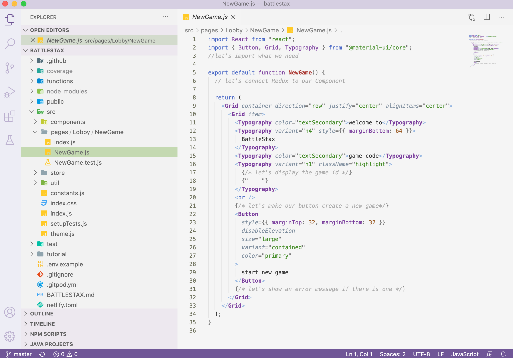

# ⚒️ Bind Redux to the User Interface

[](http://www.apache.org/licenses/LICENSE-2.0)
[](https://discord.com/widget?id=685554030159593522&theme=dark)
[](https://app.netlify.com/sites/battlestax-tutorial/deploys)

🏠 [Table of Contents](./README.md#%EF%B8%8F-table-of-contents) > ⚒️ [Create client State with Redux](./README_step03.md) > ⚒️ **[Bind Redux to the User Interface](#)**

**Objectives**

React is a great way to build a UI, but we need to connect it to our game state.

In this **step 4** we will:
+ Build out the NewGame.js component by connecting it to redux.
+ Build a test to try out the functionality of NewGame.js

**We will cover:**

1. [Import our Redux artifacts](#1-import-our-redux-artifacts)
2. [Use hooks to connect our compoonent to our Redux Store](#2-use-hooks-to-connect-our-compoonent-to-our-redux-store)
3. [Updating the UI](#3-updating-the-ui)
4. [Running TDD tests](#4-running-tdd-tests)
5. [Merge back to master](#5-merge-back-to-master)
6. [Verify your deployment in Netlify](#6-verify-your-deployment-in-netlify)

React is a popular open-source, front end, JavaScript library for building user interfaces or UI components. React makes user interfaces very easy to build by cutting each page into pieces called **components**. A React component is a bit of code that represents a piece of the page. Each component is a JavaScript function that returns a piece of code that represents a piece of a web page.

**Hooks** are a fairly new addition in React. They let you use state and other React features without writing a class. In this step, we will be using a hook to extract current state information from our Redux store.


For a **FULL** code solution to this section **`click`** the image below or just go [HERE](https://github.com/DataStax-Academy/battlestax/blob/63cc39025063de2cd04ac188baeaa1a576c954c7/src/pages/Lobby/NewGame/NewGame.js). You can also use the [RAW](https://raw.githubusercontent.com/DataStax-Academy/battlestax/63cc39025063de2cd04ac188baeaa1a576c954c7/src/pages/Lobby/NewGame/NewGame.js) version for easy copying.

[](https://github.com/DataStax-Academy/battlestax/pull/8/files)

**_Don't forget to SAVE your changes or enable autosave in GitPod._**

---

## 1. Import our Redux artifacts

In this step we will be working with `/src/pages/lobby/NewGame/NewGame.js`.



In order to bind our React component to our Redux store, we need to import the items that we need:

**✅ Step 1a: Create import statements**

📘 **Code to copy**

```javascript
//let's import what we need
import { useDispatch, useSelector } from "react-redux";
import { selectGame, createGame } from "../../../store/gameSlice";
```

### [🔝](#)

## 2. Use hooks to connect our component to our Redux Store

React Hooks allow you to access things like state, React lifecycle methods, and other goodies in function components that were previously only available in class components. 

`useSelector()` is a React Hook which allows you to extract data from the Redux store state, using a selector function. It takes in selector function argument (in this case `selectGame`) that returns the part of the state that you want.

`useDispatch()` is a React Hook that allows us to dispatch actions from our React component. Recall the `createGame` function we created in the last step.

**✅ Step 2a: Connect to the store with a hook**

📘 **Code to copy**

```javascript
// let's connect Redux to our Component
const dispatch = useDispatch();
const { id, idError, idLoading } = useSelector(selectGame);
```

### [🔝](#)

## 3. Updating the UI

**✅ Step 4a: Display game id in the UI**

When our game id is set, we want to show it in the UI. If the `id` is present, it will be rendered in the view. If not, `"----"` will show up. 

The starter code only renders `"----"` to the view. Let's modify it to include `id` as well.

📘 **Code to copy**

```javascript
{/* let's display the game id */}
{id || "----"}
```

**✅ Step 3b: Enable create game button**

We also need to change our button to create a new game and also make it disabled while a request is taking place. Add functionality to disable the button during a request.

Here is the initial button:
```javascript
<Button
    style={{ marginTop: 32, marginBottom: 32 }}
    disableElevation
    size="large"
    variant="contained"
    color="primary"
>
```

Now add more functionality to the button by concatenating in `disabled` and `onClick` code.

📘 **Code to copy**

```javascript
{/* let's make our button create a new game*/}
<Button
...concat_start...
  disabled={idLoading}
  onClick={() => {
    dispatch(createGame());
  }}
...concat_end...
```

**✅ Step 3c: Show errors in the UI**

Finally, let's show any errors.

📘 **Code to copy**

```javascript
{/* let's show an error message if there is one */}
{idError && (
  <Typography color="textSecondary">Error: {idError}</Typography>
)}
```

For a **FULL** code solution to this section **`click`** the image below or just go [HERE](https://github.com/DataStax-Academy/battlestax/blob/63cc39025063de2cd04ac188baeaa1a576c954c7/src/pages/Lobby/NewGame/NewGame.js). You can also use the [RAW](https://raw.githubusercontent.com/DataStax-Academy/battlestax/63cc39025063de2cd04ac188baeaa1a576c954c7/src/pages/Lobby/NewGame/NewGame.js) version for easy copying.

[](https://github.com/DataStax-Academy/battlestax/pull/8/files)

### [🔝](#)

## 4. Running TDD tests

We are provided with test case `src/pages/Lobby/NewGame/NewGame.test.js`. This test will check to see if our `NewGame` compenent renders properly. The <Provider> is used to make that store available to our component tree.

✔️  _TEST 1_: The `NewGame` component we created needs to beable to render without crashing.

```javascript
test("renders without crashing", () => {
  render(
    <Provider store={store}>
      <NewGame />
    </Provider>
  );
});
```

**✅ Step 4a: Test the component**

We can run our test to see if the component renders successfully.
 
📘 **Command to execute**

```bash
npm test src/pages/lobby/NewGame/NewGame.test.js
```

📗 **Expected output**


### [🔝](#)

## 5. Merge back to master

Now it's time to merge ALL of the changes from the last 3 sections back to master.  This will kick off an automated deploy to Netlify and get our changes ready for production.

📘 **Commands to execute**

```bash
git add functions/insertGame.js src/store/gameSlice.js src/pages/Lobby/NewGame/NewGame.js
git commit -m "Merging insertGame, gameSlice, and NewGame into master"
git push
```

✔️  Once you've completed the **`push`** command above go back to **YOUR** battlestax repository in **Github** and create a Pull Request to merge the changes into master. Use the same exact process we used in Step01 to do this. If you need a refresher go [HERE](./README_step01.md#3-merge-back-to-master) and then come back here to finsih your deployment.

## 6. Verify your deployment in Netlify

✔️  When your new site is ready, you will be able to go to: `<your_url>.netlify.app` to see your game. To find your URL, navigate to **`Deploys`** in **Netlify** and click on the link provided via the UI.


✔️  Once clicked you should see a display like the following:


If you start new games it will create a new record in the database. If you want to validate this behavirour click on `START NEW GAME`.

✔️  Open Astra UI, show the `CQL Console` and execute the following command (here *battlestax* is your keyspace and *games* your collection name - if you chose another names adapt the query accordingly).

📘 **Command to execute**

`SELECT key, text_value FROM battlestax.games;`

You should have a result that looks like the following image. If you see the game you just created in this list you know your application is properly hooked up to your database via the document API.


### [🔝](#)

Alrighty, let's sum all this up. If you got to this point you have now deployed an application through a **CI/CD** pipeline with **GitHub Actions** using **serverless** functions that are globally available via **Netlify** all backed by the top NoSQL distributed database Apache Cassandra on **DataStax Astra** without ever touching a server, deploying back-end code, or needing to talk to your IT folks _(no harm meant to my IT friends)_. And if your app goes viral this tech stack will scale with you.

You did this completely from front-end, fullstack knowledge. Awe...some!

Now go take this knowledge and go create the next disruptive application.

---
🏠 **Back** to [Table of Contents](./README.md#%EF%B8%8F-table-of-contents) or **move** to the next section =>[Extra Resources and certifications](./README_Resources.md)

